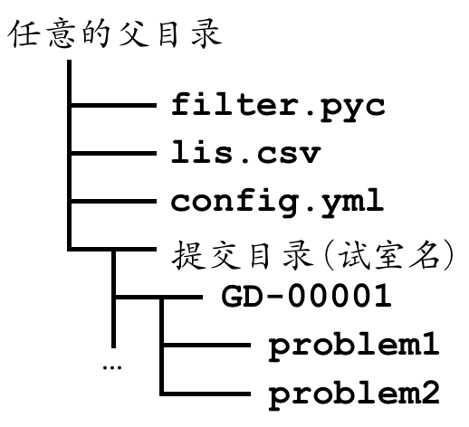

该代码已用`go`重构，请查阅新版filter:[lan](https://github.com/Lanly109/lan)，集合了`md5`功能并改善了部分功能，并摆脱了依赖配置等繁琐操作，并提供demo，做到开箱即用。

本仓库不再维护，仅作归档。

# CSP流程

## 提前准备

1. 召集考点负责人开会，各考点确定学校和试室的缩写，方便后面汇总。
2. 准备配置用的考生名单，每个考点一份，包含考号和试室缩写。（csv, 两列）
3. 考点负责人学习 pyc 的使用方法，并负责教监考员使用。
4. 考点负责人配置各试室的 yml 文件、考点的 yml 文件。

## 工具使用指南

### 关于环境

本工具依赖于 python3，试室教师机和考点负责人使用的机器需要配置 python3 才可使用。

命令行输入
```bash
pip install -r requirements.txt
```
安装依赖

### 关于配置文件

每个考点负责人需为各试室制作配置文件，例如某考场有 J1, J2, J3, J4, Y1, Y2 六个试室，则配置六个对应的文件，监考员需要将对应试室的配置文件重命名为 `config.yml`。

### 文件放置

将主程序 `filter.py` 、考点名单 `lis.csv` 、配置文件 `config.yml` 以及收取的文件夹按如下方式放置：



双击 `filter.pyc ` ，即可使用。如果文件不全或者运行异常，会在屏幕上提示。


## 配置文件yml的约定
_注意：本文件仅由考点负责人修改_

BeginTime:
  考试开始时间，格式为```"2021-10-23 14:30:00"```（注意引号不要漏掉）

EndTime:
  考试结束时间，格式为```"2021-10-23 14:30:00"```（注意引号不要漏掉）

ContestantPath：
    存放选手提交文件的文件目录，使用 "." 表示相对目录，或配置其他路径。

ContestSite:
    考场学校的缩写，比如gdfz（广大附中）,zsjz（中山纪中）。

RoomName:
    特定考场的试室号，比如 J1（计算机1室）,Y1（语音1室），空字符```''```表示无考场号，即所有考场代码

TargetPath:
    选手提交文件需要被拷贝的目标路径
    比如要将```./NOIP/GD-XXXX```移动到```~/submit/GD-XXXX```，那么此处为```~/submit/```
    默认```null```表示不需要拷贝

ContestantListFile:
    给监考人员使用的csv名单，和该配置文件同一目录，默认为```lis.csv```

CsvGBK:
    csv文件的编码，Windows（GBK编码）为```True```，Linux或Mac（UTF-8）为```False```

SkipHead:
    上述csv名单有没有标题头，```True/False```

Problems:
    该场考试题目列表

ValidSuffix:
    选手允许提交的文件名后缀(2022年可能会取消pas)

SummaryFile:
    选手提交情况总览，目前只包括统计选手正确提交的题目

TimeErrorLog:
    选手文件修改时间不在比赛时间内的结果保存文件  

## 回收期间：
4. 考前或监考闲暇时间安装python3，配置环境变量，保证可以在cmd上运行
5. 每个考场1-2位负责人，考试结束后，通过网上邻居统一收集全体考生代码
6. 收集代码，核对考场人数与实际人数是否相同（看文件夹右下角数量），如果不相同，检查哪台电脑未拷贝。

监考人员观察命令行界面信息，如正常运行，请核对统计信息是否无恙；
如有异常，请仔细检查各个文件的相对位置是否正确，或询问考场负责人，负责人返回考场查看情况，如果有异常登记在异常登记表上。

若考场无异常，拷入U盘交到准备室（注意文件夹命名），考场负责人再次使用总配置文件执行filter，若无异常，则将文件包不带修改地上传给总负责人；否则定位问题试室，重新收取。

